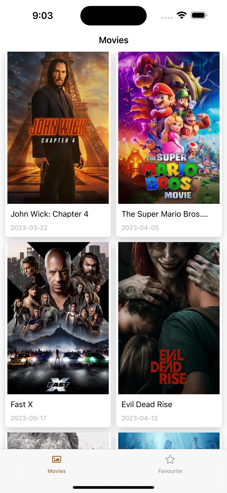
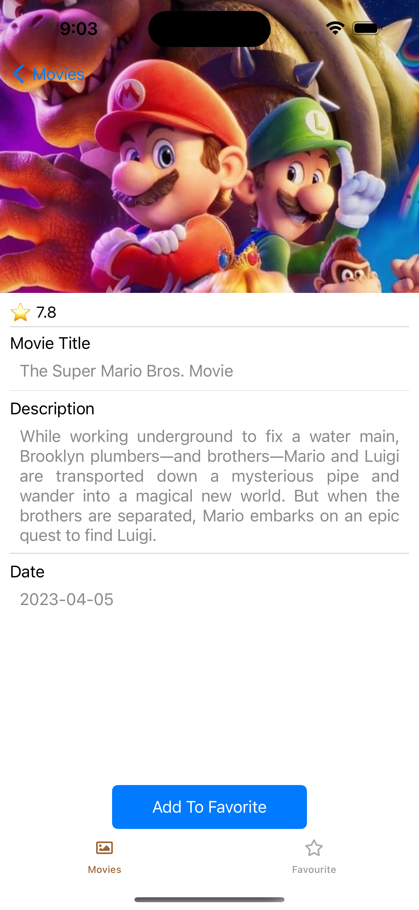

Movie App iOS With UI Kit
=============
It's sample project which is written with SwiftUI.

Screenshot
==========
Screenshot 1            |  Screenshot 2
:-------------------------:|:-------------------------:
  |  

Third party libraries
=====================
1.  Moya - [HTTP client](https://github.com/Moya/Moya) 

Author
======
Nay Lin - @naylinndev on GitHub

